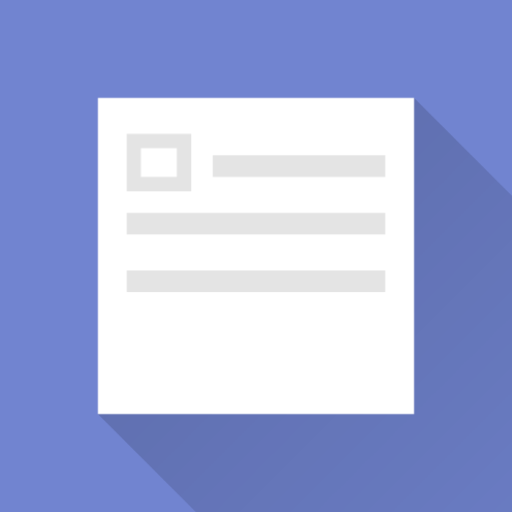
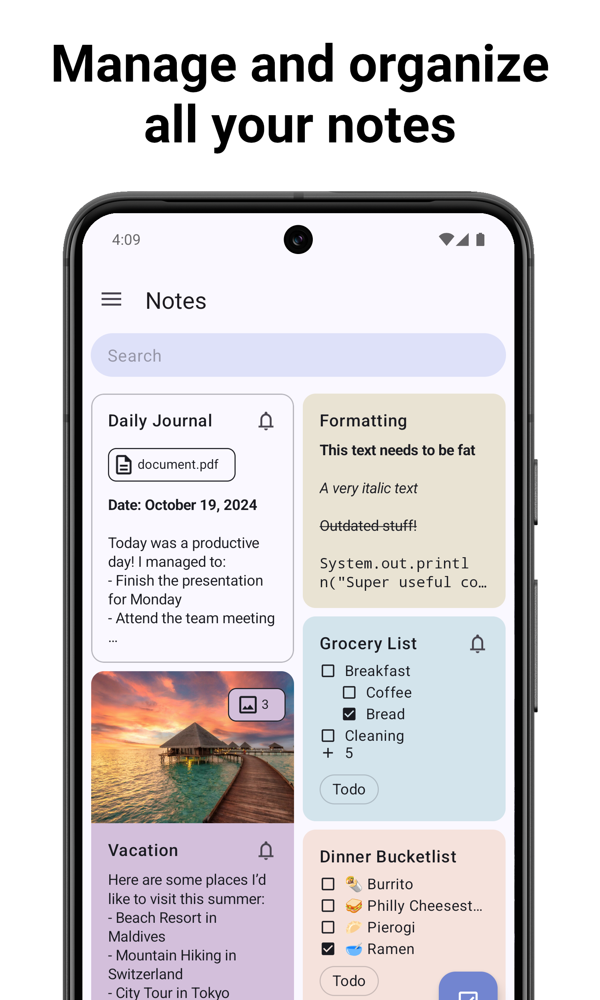
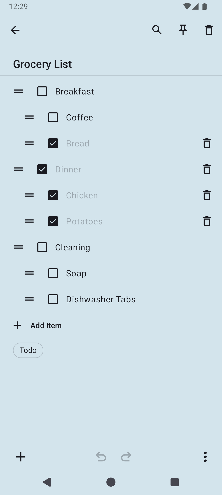
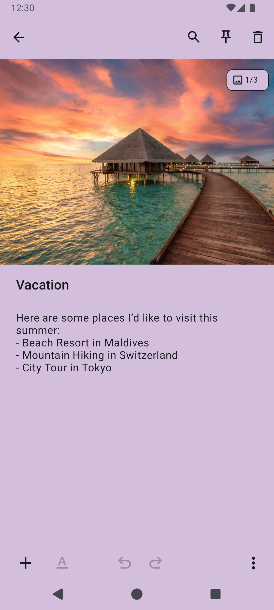
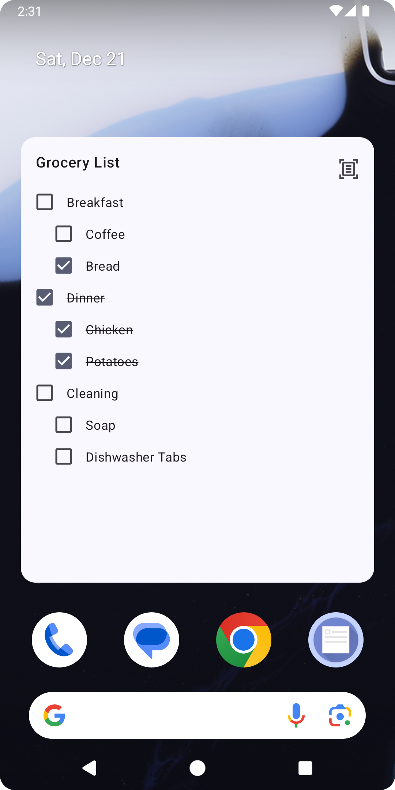
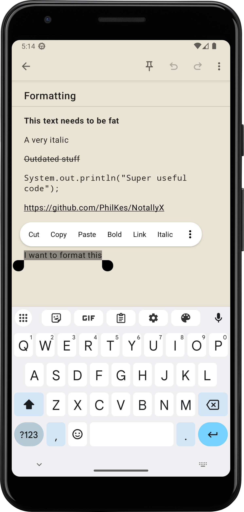
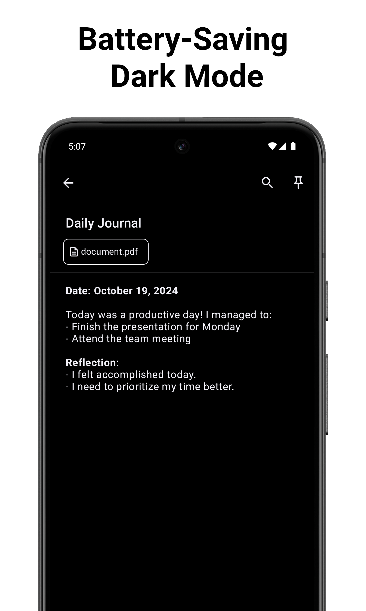

<h2 align="center">
    
     
    <b>NotallyX | Minimalistic note taking app</b>
    

        

            
            
        

    

</h2>

  
  
  

  
  
  

### Features
[Notally](https://github.com/OmGodse/Notally), but eXtended

* Create **rich text** notes with support for bold, italics, mono space and strike-through
* Create **task lists** and order them with subtasks
* Complement your notes with any type of file such as **pictures**, PDFs, etc.
* **Sort notes** by title, last modified date, creation date
* **Color, pin and label** your notes for quick organisation
* Add **clickable links** to notes with support for phone numbers, email addresses and web urls
* **Undo/Redo actions**
* Use **Home Screen Widget** to access important notes fast
* **Lock your notes via Biometric/PIN**
* Configurable **auto-backups**
* Display the notes either in a **List or Grid**
* Quickly share notes by text
* Extensive preferences to adjust views to your liking
* Actions to quickly remove checked tasks
* Adaptive android app icon
* Support for Lollipop devices and up

---

### Translations
All translations are crowd sourced. To contribute, follow these [guidelines](https://m2.material.io/design/communication/writing.html) and open a pull request.

### Contributing
If you find any bugs or want to propose a new Feature/Enhancement, feel free to [create a new Issue](https://github.com/PhilKes/NotallyX/issues/new)

If you would like to contribute code yourself, just grab any open issue (that has no other developer assigned yet) and start working.
The project is a default Android project written in Kotlin.
Before submitting your proposed changes as a Pull-Request, make sure all tests are still working, and run `./gradlew ktfmtFormat` for common formatting.

### Attribution
The original Notally project was developed by [OmGodse](https://github.com/OmGodse) under the [GPL 3.0 License](https://github.com/OmGodse/Notally/blob/master/LICENSE.md).

In accordance to GPL 3.0, this project is licensed under the same [GPL 3.0 License](https://github.com/PhilKes/NotallyX/blob/master/LICENSE.md).
